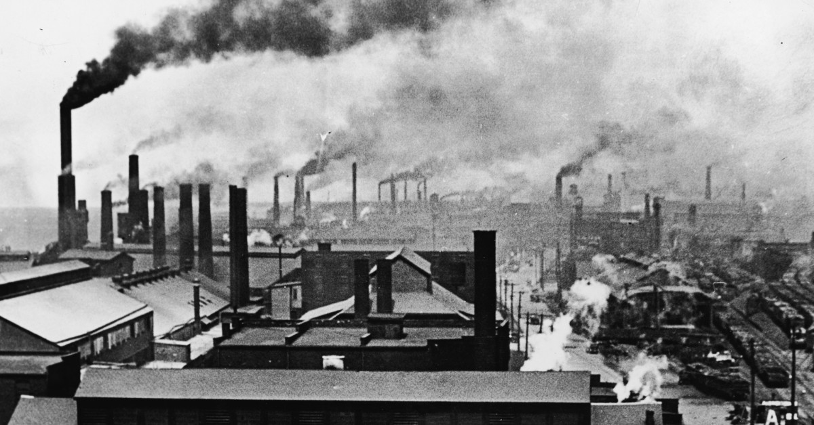

## Overview
Over Earth's 4.5 billion year lifespan, the planet has seen millions of plant and animal species that participate in nature's game of fitness, competition, predation, and evolution.  Animals are forced to be constantly vigilant and focused to identify environmental threats and opportunities.  This has seemingly been the case for all species but one -- human beings.  Humans, the only surviving species of which is formally named _Homo sapiens_, are incredibly unique animals in that we have elevated ourselves a step above the primal and dangerous game of nature and reinvented our lifestyles to be so far from those of wild primates.  The average person's daily concerns are centered around intangible societal constructs like money, work, transportation, and politics instead of food, survival, and safety from dangerous predators.

_Sapiens_ by Yuval Noah Harari offers a high-level overview of humanity's 2.5 million year existence, recounting several of the major processes that have caused our species to separate so distantly from the rest.  It's a history book, but unique in that it covers the vast history of our **species** over tens of thousands of years rather than getting stuck in the weeds of dates, events, and people that less engaging high school history classes tend to do.  Harari splits the human story up into a few primary sections, each of which is initiated by a "revolution."  This summary will journey through these revolutions to describe the deeply powerful forces that have shaped humans into what we are today.

## Our Original Place in the Food Chain
> Just 6 million years ago, a single female ape had two daughters.  One became the ancestor of all chimpanzees, the other our own grandmother.

_Antón, Mauricio. **Scimitar Cat Attacking A Hominid.** https://mauricioanton.wordpress.com._

For the first couple of million years humans existed, we were remarkably similar to apes and chimpanzees.  Modern life has made us accustomed to existing basically outside of the biological food chain; there is basically zero chance of getting mauled by a hungry lion in the middle of a downtown sidewalk.  But for over 99% of our species' historical existence, we were hunted in the same way we watch cheetahs chase gazelles in National Geographic shows.  

**The ecological niche humans filled was one of wary scavengers.**  We would wait for an apex predator to kill a large mammal and ate what it wanted.  Then we would wait for hyenas and jackals to come in and have at the remains.  Only _then_ could we finally sneak in and get to work on whatever was left, which was probably just bone marrow that we would need to meticulously extract.  This was before we'd evolved a sufficient intelligence to craft tools and weapons.  Armed with only our bodies, which are physically much weaker than those of the apes we evolved from, we wouldn't stand a chance against any respectable predator.

Given the modern human-dominated world we're used to, these conditions are unimaginable.  I think the first few chapters, which explain how humans rose out of this classic animal "survival mode" lifestyle to such super-natural power in our recent history, are easily the most fascinating of the entire book because that shift from being modest animals to the relatively care-free (survival-wise) people we are today is massively important and laid the foundation for all of the revolutionary progress that followed.

## The Cognitive Revolution (70,000 years ago)

### Rubbing Sticks Together
A human's most valuable evolutionary asset is his brain.  In the past 2.5 million years, the size of a human brain has more than doubled.  Evolution has diverted our energy investment from our muscles and digestive organs to our brain.  One of the major stepping stones on the path to human success is the **domestication of fire**, which reduces the amount of physical labor involved in acquiring food, and also reduces the amount of digestive work we have to do (chewing and chemically digesting our food).  Harari says that we actually don't know why evolution drove our brain to grow so much, which I find frustrating since this is one of our most unique evolutionary features.

### Language, our Secret Sauce
Regardless of the evolutionary rationale, our big brains established the neural infrastructure necessary to support the evolution of a new ability, which Harari emphasizes as the **key factor in _Homo sapiens_' intellectual leap: the emergence and usage of language**.  Spoken language affords us the immense power of communicating, understanding, and remembering abstract, intangible ideas and concepts.  It's critical to avoid understating the importance of this abstraction.  Other animals have spoken language as well -- Harari cites an example of monkeys being able to signal 'Careful, a lion!' -- but _Sapiens_ language is unique in that we can compose arbitrary sounds, called [phonemes](https://www.dyslexia-reading-well.com/44-phonemes-in-english.html), into millions of different words.  Monkeys' linguistic mapping of _this screech means this and that screech means that_ is incredibly limiting in this regard, both in the detail of what they can express and the ability to communicate information about intangible things.

### Gossip and Social Groups
This ability to communicate abstract ideas carried with it the unprecedented capability of forming and maintaining **large social groups**.  These social groups are bigger and more cohesive than groups formed by any other species on the planet.  The value of large social groups isn't made explicit in the book, but from a prehistoric tribal warfare perspective, it seems intuitive that a coordinated group of 200 animals beats a loosely held together clan of 50 pretty easily.  Language offers two major benefits that facilitate these large social groups of humans.  The first is that the ability to speak a sophisticated language increases the amount of social information that can be communicated (or "gossiped") within a social network.  

To maintain a large social group, it's important that individuals within the group can distinguish between trustworthy, benevolent members and untrustworthy free riders.  The "free rider problem" is something that's often brought up in discussions of government safety net programs, and has a similar meaning in anthropological literature.  A social free rider is an individual who exploits the benefits provided by a social group without contributing anything.  As stated by anthropologist Robin Dunbar in his 2004 paper, ["Gossip in Evolutionary Perspective"](https://journals.sagepub.com/doi/abs/10.1037/1089-2680.8.2.100), free riders can be remarkably destructive to social groups.  By gossiping about a free rider, or exposing information about a group member's negative qualities to others, social groups are able to identify the members of the group that do more harm than good and mitigate their destructive potential.  Spreading of detailed social information via language is a major factor contributing to _Sapiens_' ability to maintain cohesion and stability within groups and push hunter-gatherer group sizes up into the hundreds, significantly higher than the average ceiling on primate groups, which sits around 80 members. 

### Collective Myths
The second major benefit that _Sapiens_ language provides to social cohesion is that it permits the propagation and widespread belief of what Harari calls **collective myths**.  Collective myths are fictional stories that everyone believes in or agrees upon without being connected to any physical, tangible substrate.  He also refers to these myths as _inter-subjective realities_, meaning things that have no objective physical existence but are still believed to exist by everyone in a community.  Some examples of collective myths are religions, nations, companies, and laws.  A well-established collectively believed fiction enables two people who barely know each other to feel some level of trust and camaraderie.  Groups can expand far beyond the size limitations imposed by communities that are held together solely by social information and communication (which is about 150 members, [Dunbar's number](https://en.wikipedia.org/wiki/Dunbar%27s_number)) because unacquainted members can cooperate on the basis of a mutual belief in something bigger than themselves.  Prior to today's world where there exist a much greater number of collective myths, the most effective myth throughout ancient history was religion, due to its ability to unite large numbers of people and prescribe specific behaviors.

### This Town Ain't Big Enough for the Two of Us
_Homo sapiens_ are the only species of humans that exist in today's world.  We've come to equate "human" to _Sapiens_, but this equivalence hasn't always been the case.  Historically there have been a handful of other human species, some notable ones being _Homo erectus_, _Homo floresiensis_, and _Homo neanderthalensis_.  Neanderthals are the closest species to us at around [99.7% genetic similarity](https://www.discovermagazine.com/planet-earth/how-are-neanderthals-different-from-homo-sapiens), and co-inhabited the Earth, along with a couple other human species, at the same time as early _Homo sapiens_.  This begs the question: **why did _Sapiens_ survive while no other human species did?**

The likely answer to this question is that _Sapiens_ differed from these other human species in the ways we've looked at: superior language and a resulting ability to communicate knowledge and form large social groups united by common myths.  This was obviously beneficial in terms of survival, but it's also possible that these things caused _Sapiens_ not just to outlive their peers but to drive them to extinction.  Due to _Sapiens_' social skills, they could defeat Neanderthals in tribal battles despite being less muscular.  

Given the frequent tension and conflicts between today's humans, all of whom are members of the same species, it's certainly conceivable that these archaic populations may have exhibited violent inter-species aggression, especially if there was territorial violation or limited resources.  This morbid explanation of the discontinuation of other human species is called "[Replacement Theory](https://en.wikipedia.org/wiki/Neanderthal_extinction#Violence)."  An alternative hypothesis, "Interbreeding Theory", says that Neanderthals were not completely eliminated but instead merged into _Sapiens_ through cross-species breeding.  Harari cites [evidence](https://www.ncbi.nlm.nih.gov/pmc/articles/PMC5100745/) that supports this view, and it seems that many articles published after the book also favor this alternative.

Although there is some contention over whether we drove Neanderthals to their fate, there is much stronger consensus behind the belief that _Homo sapiens_ signed the death sentence for many other animal species.  The arrival of linguistically talented, well-coordinated bands of _Sapiens_ shattered the equilibrium that had existed in untouched lands like Australia and South America for hundreds of thousands of years.  **_Homo sapiens_ likely caused massive ecosystem collapse in almost all the places they spread to**, and this happened for two reasons.  Firstly, they **over-hunted** species that hadn't developed adaptations to human predation.  A huge woolly mammoth had never run into a smaller, weaker human before, and probably failed to identify it as a threat.  And secondly, humans had domesticated **fire** over a hundred thousand years prior, which they used to drastically change the natural ecology and clear out vegetation to make large mammals easier to hunt.  One well-known example of _Sapiens_' destruction is the extinction of the [Australian megafauna](https://phys.org/news/2017-01-humans-climate-australian-megafauna.html), in which 23 of the 24 Australian animal species weighing over 100 pounds went extinct shortly after humans' arrival around 45,000 years go.  The story was similar for other geographical regions upon initial human arrival.  These mass extinction events display the power the Cognitive Revolution had to elevate us above the natural limitations faced by all other animal species.

## The Agricultural Revolution (12,000 years ago)

_Costa, Leopoldo. "Agricultural Revolution." **S T R A V A G A N Z A**, 26 June 2017, https://stravaganzastravaganza.blogspot.com/2017/06/agricultural-revolution.html._

Until about 12,000 years ago, humans lived a lifestyle of [**hunting and gathering**](https://www.nationalgeographic.org/encyclopedia/hunter-gatherer-culture/).  They got their food by catching small mammals and insects (prior to the Cognitive Revolution), going on group hunting expeditions for bison and mammoths (afterwards), and scavenging forests and grasslands for edible nuts, berries, and vegetation.  The Agricultural Revolution marked a major shift in _Sapiens_ lifestyle: instead of hunting and gathering, they settled down and domesticated a limited set of plants and animals.  Although this revolution has historically been deemed one of mankind's greatest innovations, as it allowed human population size to explode upwards, Harari offers a much different perspective: he calls it **"humanity's greatest fraud."**

### A Disastrous Trap
He makes his argument by pointing out several of the key differences between hunter-gatherer and agricultural lifestyles, and the disadvantages that come with the latter:

1. **People had to work longer, harder hours.**  A hunter-gatherer would spend 35-45 hours per week exploring a forest or searching for small animals to catch.  The generous amount of leisure time available to hunter-gatherers has spawned a theory that these early humans enjoyed the ["original affluent society"](https://en.wikipedia.org/wiki/Original_affluent_society).  In contrast, a prehistoric farmer had to clear fields, distribute water, defend against pests, and fertilize crops from sunrise to sundown every day.  These are activities that humans hadn't spent the past 2 million years evolving to do, so they increased the frequency of back and neck problems.
2. **Agricultural diets were less nutritious than hunter-gatherer diets.**  Hunter-gatherers eat whatever their environment gives them.  It's an extremely varied diet -- Harari offers the example that one day's diet might include mushrooms, fruits, snails, and rabbits, and the next day could be completely different.  This variety makes it much more likely that people are getting the vitamins and nutrients they need to be healthy.  Fossilized skeleton evidence indicates that foragers were less likely to suffer from malnutrition, and children who survived their first few years were likely to make it to sixty or even eighty years of age.  Diets found in agricultural societies, on the other hand, consisted primarily of a single staple crop, probably potatoes, wheat, or rice.  The invariability of this diet certainly lacked sufficient nutritional diversity and was harder for bodies to digest, leading to greater incidences of malnutrition.  This hypothesis forms the basis of the modern [paleo diet](https://www.mayoclinic.org/healthy-lifestyle/nutrition-and-healthy-eating/in-depth/paleo-diet/art-20111182).
3. **Stationary settlements left populations more vulnerable than their hunter-gatherer counterparts.**  Picking a nice place to settle down and build a nice, peaceful farming community sounds pretty safe, right?  This turns out not to be the case.  Agriculture actually makes a population more vulnerable to two threats: (1) famine and (2) attacks from other tribes.  Early farmers put all their eggs in one basket: they were completely dependent on successful production of large amounts of rice, wheat, potatoes -- whatever their crop of choice was.  If there was a bad growing season due to weather or insects, thousands would starve to death.  Also, people were rooted to their settlements.  They'd invested tons of effort in cultivating fields, building shelters, and collecting material goods.  If they were attacked by a band of foragers or a competing farming society, they couldn't easily migrate as foragers could.  Often they would be forced to stand their ground and fight to the death in defense of the geographic area they so heavily relied upon.

These downsides seem like they would incentivize farmers to revert to the more desirable hunter-gatherer lifestyle, but there's a reason they didn't.  Even if people had realized that individual quality of life was worsening, the trajectory towards domestication and settlement was unstoppable.  For this reason, Harari also labels the Agricultural Revolution as "the luxury trap."  The food production increase allowed tribes to support greater carrying capacities, which in turn increased the demand for more food!  Once agriculture started, it couldn't be stopped, and its consequences remain embedded into our diets and lifestyles today.
> Even today, with all our advanced technologies, more than 90% of the calories that feed humanity come from the handful of plants that our ancestors domesticated between 9500 and 3500 BC -- wheat, rice, [corn], potatoes, millet and barley. [...] If our minds are those of hunter-gatherers, our cuisine is that of ancient farmers.

### What is evolutionary "success?"
Of course, a strong argument could be made that the agricultural lifestyle yielded some big advantages.  One is that **agriculture's efficiency allows us to support a much larger population**.  But Harari points out an interesting question: _what does it mean for humans, or any species, to be successful?_  Agriculture significantly increased the number of _Homo sapiens_ on Earth, and from an evolutionary perspective, more copies of human DNA is a huge victory.  Despite there being _more_ humans, however, the average **quality of life** of a human worsened.  There was a similar dichotomy for the animals we domesticated -- chickens, cattle, and pigs became the most prolific animal species on the planet, despite the restrictive and unpleasant lifestyles they were forced to adopt.  This **mismatch between evolutionary forces and individual well-being** is interesting to think about; we'll see it come up again in the book's concluding discussion of human happiness.

### Who Domesticated Who?
It is often humans who are seen as the ones domesticating other species, but Harari actually blames wheat for domesticating _us_.  Wheat used to be an unspectacular wild grass competing among many in the Middle East.  Then, in the blink of an eye (in geological timescales), it quickly became one of the most dominant plant species in the history of the planet, covering almost one million square miles of the Earth's surface.  Harari claims that it became so successful by manipulating humans into doing the grueling work to grow, spread, and protect it.  I think it's worth exploring these theories in which some universal force is manipulating humans rather than the other way around, a thought-provoking divergence from Anthropocentrism.  Some examples that come to mind are Elon Musk's quote that humanity is a "biological [boot loader](https://www.wired.com/story/elon-musk-humanity-biological-boot-loader-ai/) for artificial intelligence", and the [idea](https://durmonski.com/book-summaries/the-selfish-gene/#4-lesson-1-the-main-goal-of-the-body-is-to-propagate-copies-of-the-genes) proposed by Richard Dawkins in _The Selfish Gene_ that human bodies are expendable machines that exist only to move our genes forward through time.

### Global Unification
Following the Agricultural Revolution, the communities people lived in began to grow larger and larger.  Small tribes of a few hundred people became towns, cities, and eventually large empires.  There was a notable decrease in the "us vs. them" cautious tribalism mentality and more of a push towards globalization and large social cooperation networks.  One of the prerequisites to expanding human civilizations up into the hundreds of thousands is the establishment of what Harari calls **imagined orders**.  These imaginary social orders are built upon [collective myths](#collective-myths) and are only effective if everyone believes in them; some examples are the Code of Hammurabi and the American Declaration of Independence.  **The three universal imagined orders that drove this shift towards unification were money, imperialism, and religion.**

The advent of money took trade and commerce to a new level, unifying people across borders.  It solved the dilemma of trade that limited transactions to only the ones where the traders had a mutual interest in each other's items.  With money, an arbitrary physical currency that represents economic value, everyone wanted to trade with everyone, and people viewed foreigners not as adversaries but instead people who **shared a similar trust** in money and who might be willing to purchase something.  

Imperialism was another extremely powerful uniting force -- think about huge empires like the Mongol, Spanish, Russian, British, and the Qing dynasty.  Empires have a **natural motivation to swallow up the world** within themselves, partly to increase their legitimacy but also because many empires believed that they were doing conquered peoples a favor by introducing them to a superior culture.  

The final uniting force was religion.  Religion became more widespread after the Agricultural Revolution, which Harari hypothesizes may be due to humans' changing relationship with nature.  With a new reliance on domesticated plants and animals, **humans turned to superhuman forces** to help protect and nourish their fields and animals.  He points out that monotheistic religions (in contrast to polytheistic religions) exert more pressure to unite because missionaries are incentivized to align everyone into their worldview.

## The Scientific Revolution (1500s)

_“Darwin's Tree of Life Sketch.” **BBC News**, Cambridge University Library, 24 Nov. 2020, https://www.bbc.com/news/entertainment-arts-55044129._

With the world of humanity unified into a handful of powerful empires backed by commerce and religion, things seemed to be relatively stagnant for a while.  Sure, there are entire history classes dedicated to these imperial periods, but at a macroscopic scale, the course of humanity wasn't changing much.  This stale trajectory took a dramatic shift when the Scientific Revolution came along.  Suddenly, **human progress**, innovation, and power **started growing exponentially**, a theme we are very familiar with in the modern world of [Moore's Law](https://en.wikipedia.org/wiki/Moore%27s_law) and Ray Kurzweil's theory of a technological [singularity](https://waitbutwhy.com/2015/01/artificial-intelligence-revolution-1.html).  Today, scientific thinking is deeply embedded in our society and education philosophy.  

The Scientific Revolution consisted of three major changes in thinking:

1. **We started admitting our ignorance about the world.**  Monotheistic religions, the most popular of which are Christianity and Islam, preach that their God is all-knowing and omnipotent.  Anything that is needed to be known about the world will be contained in their respective scripts, the Bible and the Quran.  In this perspective, there is no opportunity to acknowledge that there are things we don't know.  In fact, followers of the religion are actually incentivized to vehemently deny any possibility that their God has revealed inadequate knowledge, as this is a sign of weakness of their religion in comparison to others who are more confident in their God's omnipotence.  During the Scientific Revolution, we began to identify things that we don't understand and sought to learn about them through our own research.
2. **We started valuing mathematics and precise observation.**  In our quest for new knowledge, we began closely observing the world around us.  To connect these observations to comprehensive theories, we derived mathematical equations instead of narrative stories.  When we found that certain fields are too complex for simple equations, we developed **statistics**, a new branch of mathematics.  Our use of statistics has become even more prevalent today -- the field forms the backbone of techniques like machine learning and neural networks that modern day tech companies leverage to gain insights from data.
3. **We used scientific discoveries to gain power.**  The Scientific Revolution introduced a positive feedback loop between knowledge and power.  As empires acquired new scientific knowledge, they were able to use this to increase their military prowess or economic productivity.  This motivated greater investment in scientific research to further empower the civilization.  Harari says "most scientific studies are funded because somebody believes they can help attain some political, economic, or religious goal."  The link between science, technology, and military was evident during World War I and World War II, during which combat aircraft, poison gas, and the atomic bomb were invented.

### Imperialism and Science
The Scientific Revolution was fueled by two things: **imperialism and capitalism**.  Empires valued science due to point #3 above -- there was a causal relationship between scientific discovery and imperial hegemony.  The imperial advantage of science is exemplified by the discovery of vitamin C's ability to cure scurvy.  The disease, for many years, was a dreadful inevitability of sea-faring exploration missions.  For any given expedition, it was expected that over half of the crew would die from scurvy.  In 1747, a British physician named James Lind [conducted](https://www.bbvaopenmind.com/en/science/leading-figures/james-lind-and-scurvy-the-first-clinical-trial-in-history/) the "first clinical trial in history", separating diseased sailors into several different treatment groups.  He discovered that the groups that ate citrus fruits were suddenly cured.  Since this discovery, sailors have been advised to consume lots of fresh fruits and vegetables while out on the sea, and it has allowed for longer, more productive expeditions.  

Subsequent expeditions have yielded incredibly valuable results due to a tight intertwining of territorial conquest and knowledge discovery.  From the eighteenth century onward, all exploratory military expeditions departing from Europe included hundreds of scientists on board.  In 1831, the Royal Navy departed to map the South American coast.  The ship's captain wanted a geologist to study some rock formations they might find, and ultimately invited a freshly graduated Charles Darwin.  Of course, Darwin got a bit distracted from geological research while collecting observations, and instead used his research to formulate his very well-known theory of evolution.

### Capitalism and Science
Capitalism was the second force that pushed the Scientific Revolution forward.  Capitalism and science go hand in hand because (1) science is expensive and requires funding, and (2) scientific discoveries can lead to **technological improvements or access to resources that generate economic value**.  A powerful example that Harari shares to illustrate this synergy is Christopher Columbus' trade route exploration mission in 1492.  In a section titled "Columbus Searches for an Investor", Harari describes the numerous pitches Columbus made to potential investors for his expedition. He proposed his plan to investors in Portugal, Italy, France, and England -- all declined.  Eventually, he approached Spanish rulers Ferdinand and Isabella.  They decided to grant him the money he needed, and it paid off _massively_ for Spain.  Columbus' "discovery" of South America allowed the Spaniards to establish gold mines and sugar plantations that made Spanish kings and merchants incredibly wealthy.
> This was the magic circle of imperial capitalism: credit financed new discoveries; discoveries led to colonies; colonies provided profits; profits built trust; and trust translated into more credit.

The Spanish conquest of South America provides a good example of how investment in science could benefit a civilization, both imperially and economically.  Of course, this displays the dark side of imperialism -- this ordeal turned out quite badly for the native population -- but it was very beneficial for Spain.  Harari notes that European empires leaned into the Scientific Revolution much more than Asian empires did between 1750 and 1850, which explains in a large part why Western (European) culture and ideology is so widespread in today's world.

## The Industrial Revolution (1800s)

_Welgos. “Second Industrial Revolution.” **History**, Getty Images, 2019, https://www.history.com/news/second-industrial-revolution-advances._

### Harnessing Energy
With the Industrial Revolution in the 19th century, we gained the ability to mass produce material goods, especially textiles and iron.  This production efficiency came from our discovery of **new ways of harnessing and making use of energy**.  The key invention that enabled this revolution was the [**steam engine**](https://www.thoughtco.com/steam-engines-history-1991933), which converts heat into movement.  In early steam engines, fire is used to burn coal.  The heat released from this process increases the temperature of water in a tank until the water begins converting into steam.  Steam occupies much more volume than water, and the pressure created from the water -> steam conversion pushes on a piston, creating mechanical movement.  This back-and-forth movement can optionally be converted into rotational movement by connecting the piston to a flywheel.   Upon inventing the steam engine, we realized that we are able to convert one type of energy to another using machines.  This led to the inventions of combustion engines, nuclear weapons, and electricity.  

The emphasis Harari places on the Industrial Revolution as "a revolution in energy conversion" reminded me of something called the [Kardashev scale](https://www.thoughtco.com/steam-engines-history-1991933), which measures the technological advancement of a civilization based on its ability to capture environmental energy.  I've heard this scale mentioned in videos that hypothesize about super advanced alien civilizations.  It seems that the Industrial Revolution is an early step in reaching an extraordinary level of technological advancement enabled by our ability to manipulate the universe's energy.

### Buy! Buy! Buy!
A consequence of mass production is that suddenly, there's much more supply than demand.  In many ancient cultures, frugality and simplicity were virtuous.  But with the Industrial Revolution came abundance of material goods, and to meet this new supply a new cultural phenomenon was created: **consumerism**.  Consumerism encourages everyone to buy tons of things, regardless of whether they are needed.  Harari says it is the "first religion in history whose followers actually do what they are asked to do."  Modern marketing pushes us to follow consumerist ideas, even though doing so is often bad for us.  Harari provides the example of health and fitness.  There is an increasingly prevalent obesity problem in the developed world, which is fueled by the over-consumption of mass produced, unhealthy foods.  To address this problem, many people spend additional money on diet products instead of reducing their consumption.  This tendency to buy more in order to solve the original problem of buying too much is a powerful illustration of the downsides of consumerism.  

A similar criticism is posed in the documentary [_Fed Up_](https://www.imdb.com/title/tt2381335/), which calls out large processed food corporations for distributing products that are high in addictive sugar, often behind the disguise of being "reduced fat" or "low calorie."  Although we've discussed some of the merits of capitalism in terms of encouraging innovation and technological advancement within our species, this behavior of **cultivating demand against the consumer's best interest** reveals a dark side to market incentives.

### Shifting Towards State & Market
One other result of the Industrial Revolution that Harari mentions is the shift from relying on **family & community to state & market** for everyday support and services.  Up until the nineteenth century, family and community played a large role in daily life.  If you needed help taking care of your child or fixing a leak in your roof, you'd ask a family member or neighbor.  Within these communities, favors were exchanged back and forth with much less quantitative strictness than is associated with the free market.  Post-revolution, the state offered solutions for core needs such as food, employment, welfare, and services.  Government-funded schools teach kids, banks loan money, and paid nurses care for the sick and elderly.  This is accompanied by a shift towards **individualism** due to a decreased reliance on family.  Harari notes that this sudden cultural change may have an adverse effect on our well-being:
> Millions of years of evolution have designed us to live and think as community members.  Within a mere two centuries we have become alienated individuals.

There does seem to be an advantage to this shift, though.  Overall, increased power of the state has **reduced the amount of violence** within communities.  Historically, law enforcement and police force has had limited ability to mediate conflicts between individuals and communities.  In the Ottoman Empire, criminal justice was dealt with by the families.  If your cousin killed someone, _you_ might be killed by one of the victim's family members as an act of revenge.  
> Life in the bosom of family and community was far from ideal.  Families and communities could oppress their members no less brutally than do modern states and markets, and their internal dynamics were often fraught with tension and violence -- yet people had little choice.

Taking power away from the family and community and putting it instead in the hands of police forces and criminal courts does seem to be quite appealing for its offering of increased peace and tranquility.

## A Reflection on Human Happiness
We're on the treadmill.

## Conclusion: 5 Key Takeaways
1. one
2. two
3. three
4. four
5. five
